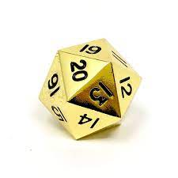

# Workshop 4  

By: Zack B.

## Emphasis

If you have applied to Trent, or have received an Offer of *Admission, you can activate your MyTrent account here. You will need your Trent* Identification Number provided _in your application acknowledgement email._ If you are unable to find your ID, you can retrieve it here OR please contact.

## Strong

If you have applied to Trent, or have **received an Offer of Admission,** you can activate your MyTrent account here. You will need your Trent Identification Number provided in your application acknowledgement email. If you are unable to find your ID, you can retrieve it here OR please contact

## Lists

### Unorderded List

- List item 1
- List item 2
  - List sub item
  - List sub item 2
- List item 3

### Ordered List

1. First item
2. second item
3. third item

## Images



[This is a link](https://www.trentu.ca/mytrent)

## Including Code

### Inline

This is a randome example `this is code` so yeah

### Code Fences

```html
<nav>
    <ul>
        <li><a href="index
        html">Home</a></li>
        <li><a href="grid.html">Grid</a></li>
        <li><a href="https:
        trentu.ca">Trent</a></li>
        <li><a href="https://loki.trentu.ca">Loki</a></li>
    </ul>
</nav>
```

```css
body {
  font-family: system-ui, -apple-system, BlinkMacSystemFont, "Segoe UI", Roboto,
    Oxygen, Ubuntu, Cantarell, "Open Sans", "Helvetica Neue", sans-serif;
  height: 100vh;
  display: flex;
  flex-direction: column;
}
```
